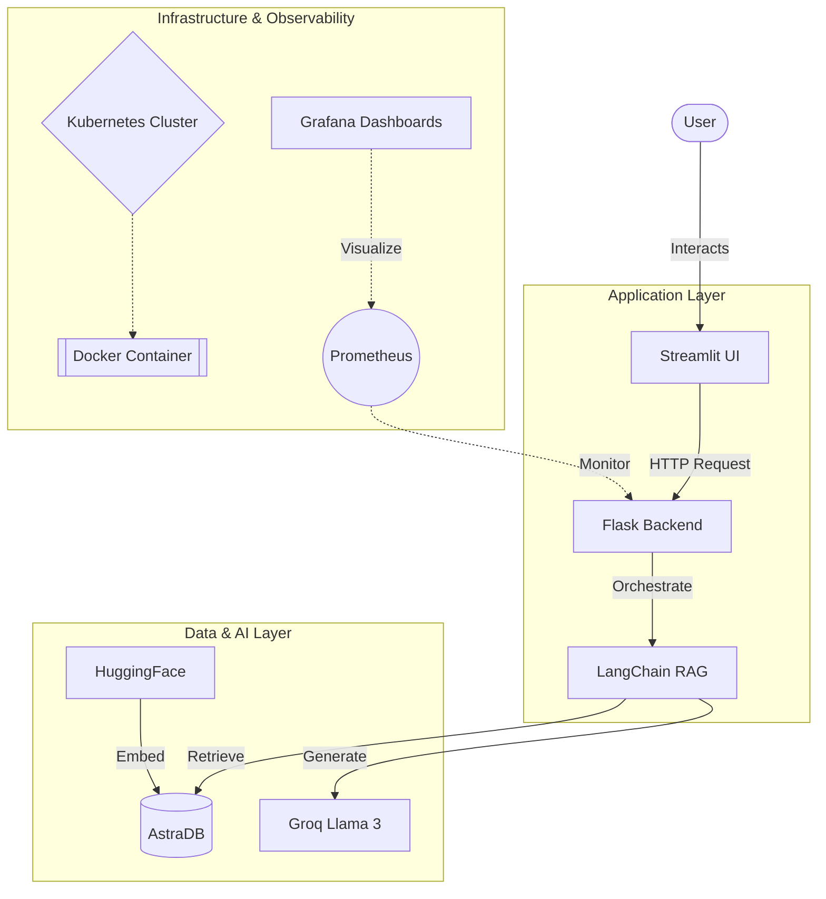
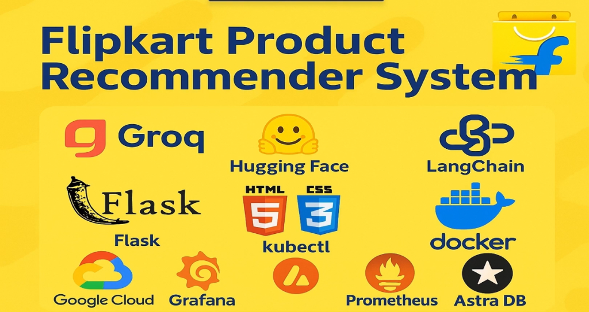
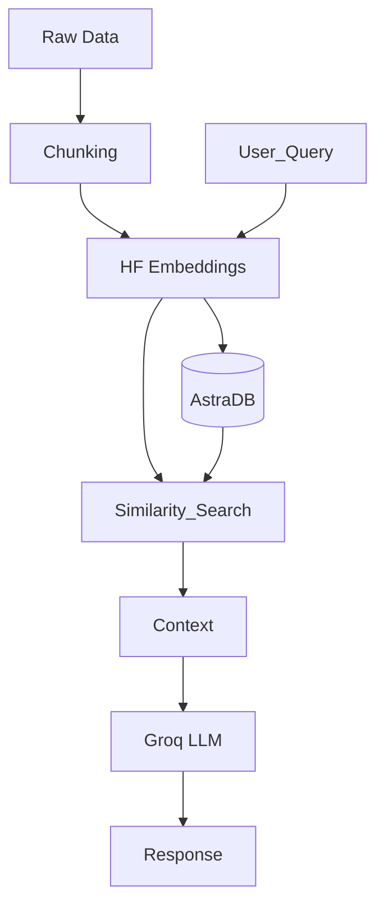

# 🛒 Agentic AI | GenAI RAG Product Recommender

[](https://universal-pdf-rag-chatbot-mhsi4ygebe6hmq3ij6d665.streamlit.app/)
[](https://www.python.org/downloads/release/python-390/)
[](https://opensource.org/licenses/MIT)
[](https://www.docker.com/)
[](https://kubernetes.io/)


> **A Production-Grade E-commerce Recommendation System built with RAG Architecture, Groq Llama 3, LangChain, and AstraDB.** 
> *Deployed on Kubernetes with Prometheus/Grafana O11y.*

---

## 📑 Table of Contents

- [⚡ Executive Overview](#-executive-overview)
- [🏗️ System Architecture & Visuals](#-system-architecture--visuals)
- [🚀 Quick Links](#-quick-links)
- [🛠️ Technical Ecosystem](#-technical-ecosystem)
- [🔄 RAG Pipeline & Workflow](#-rag-pipeline--workflow)
- [📱 Key Features](#-key-features)
- [📂 Project Structure](#-project-structure)
- [🛠️ Installation & Setup](#-installation--setup)
- [🔮 Roadmap](#-roadmap)
- [📄 License & Contact](#-license--contact)

---

## ⚡ Executive Overview

The **Flipkart Product Recommender** is an intelligent conversational AI designed to revolutionize e-commerce discovery. Moving beyond traditional keyword search, it leverages **Retrieval-Augmented Generation (RAG)** to understand user intent deeply and semantically retrieve relevant product reviews from **AstraDB**, generating highly contextual responses using the ultra-fast **Groq Llama 3.1** engine.

This project showcases a complete **End-to-End LLMOps Pipeline**, featuring data ingestion, vector storage, RAG chain orchestration, a robust Flask backend, an interactive Streamlit UI, and cloud-native deployment on Kubernetes with full observability.

---

## 🏗️ System Architecture & Visuals

A high-level visual guide to the system's design, workflow, and monitoring capabilities.

### 🔹 High-Level Architecture
> *User → UI → Backend → LLM + Vector DB → Response → UI*



### 🔹 Comprehensive Workflow Integration
> *Detailed data flow from Ingestion to Generation.*


### 🔹 LLMOps & Observability Dashboard
> *Real-time monitoring of System Health and Latency using Prometheus & Grafana.*


### 🔹 Technology Stack Overview
> *Full stack breakdown including AI, DevOps, and Backend components.*


---
## 🌐🎬 Live Demo
🚀 **Try it now:**
- **Streamlit Profile** - https://share.streamlit.io/user/ratnesh-181998
- **Project Demo** - https://flipkart-appuct-recommender-rag-qpisu9s2oo4dyjr3fpp4yf.streamlit.app/
  
---

### 🎬 Live Project Demo
> Experience the full flow:


---

## 🛠️ Technical Ecosystem

This project creates a robust synergy between modern AI frameworks and cloud-native infrastructure.

### 💻 Core Tech Stack
1.  **Groq**: Ultra-low latency LLM Inference Engine (LPU).
2.  **HuggingFace**: State-of-the-art Embedding Models.
3.  **LangChain**: Orchestration framework for RAG workflows.
4.  **AstraDB**: Serverless, high-performance Vector Database.
5.  **Flask**: Lightweight Backend API.
6.  **Streamlit**: Interactive Frontend UI.
7.  **Docker**: Containerization for consistent environments.
8.  **Kubernetes (Minikube)**: Container Orchestration & Scaling.
9.  **GCP VM**: Cloud Infrastructure host.
10. **Prometheus**: Metrics Collection & Monitoring.
11. **Grafana**: Data Visualization & Dashboards.
12. **GitHub**: Version Control & CI/CD.

### 🧠 Deep Dive: Core AI Layer

#### 1. Groq (LLM)
*   **Role**: The brain of the system.
*   **Why**: Selected for its **LPU (Language Processing Unit)** technology which delivers near-instant inference speeds, critical for real-time chat experiences.

#### 2. Hugging Face (Embeddings)
*   **Role**: The semantic translator.
*   **Function**: Converts raw text reviews into high-dimensional vectors, capturing the *meaning* behind the words for accurate retrieval.

#### 3. AstraDB (Vector Store)
*   **Role**: The knowledge base.
*   **Why**: A cloud-native, serverless vector store based on Cassandra. It offers scalability and zero-management overhead, perfect for handling large datasets of product reviews.

---

## 🔄 RAG Pipeline & Workflow

The system follows a precise logic flow to ensure accurate and grounded responses.

### Logic Flow
1.  **Ingestion**: Raw review data (CSV) is loaded and cleaned.
2.  **Chunking**: Text is split into semantic chunks using `RecursiveCharacterTextSplitter`.
3.  **Embedding**: Chunks are vectorized using `BAAI/bge-base-en-v1.5`.
4.  **Storage**: Vectors are stored in **AstraDB**.
5.  **Retrieval**: User queries are embedded; similarity search finds the top-k relevant contexts.
6.  **Generation**: **Groq** synthesizes the context and query into a helpful response.

### Pipeline Visualization


---

## 📱 Key Features

### 1️⃣ 🎬 Live Demo Tab
The heart of the application.
- **ChatGPT-Style Interface**: Familiar and intuitive chat experience.
- **Dynamic Product Cards**: AI auto-generates structured product cards with images, prices, and links based on the conversation.


### 2️⃣ 📖 About Project Tab
Context and Education.
- Explains the **Problem Statement** (limitations of keyword search) and the **GenAI Solution**.


### 3️⃣ 🔧 Tech Stack Tab
Transparency.
- Visually displays the technologies used, building trust in the system's robustness.


### 4️⃣ 🏗️ Architecture Tab
System Design.
- Interactive diagrams allowing users to explore the data flow and infrastructure.


### 5️⃣ 📋 System Logs Tab
Observability for Developers.
- Real-time stream of application logs (Info, Warning, Error).
- Health check status for API, Database, and LLM connections.


---

## 📂 Project Structure

```plaintext
Flipkart-Product-Recommender-RAG/
├── .streamlit/          # Streamlit configuration
├── data/                # Raw dataset (CSV/JSON)
├── flipkart/            # Core application logic package
├── grafana/             # Grafana dashboard configurations
├── prometheus/          # Prometheus monitoring rules
├── static/              # CSS styles and images
├── templates/           # HTML templates for Flask
├── utils/               # Helper functions (logger, exceptions)
├── .env.example         # Template for environment variables
├── .gitignore           # Git ignore rules
├── Dockerfile           # Docker build configuration
├── LICENSE              # MIT License
├── README.md            # Project documentation
├── app.py               # Flask backend entry point
├── flask-deployment.yaml# Kubernetes deployment for Flask
├── requirements.txt     # Python dependencies
├── setup.py             # Package installation script
└── streamlit_app.py     # Streamlit frontend entry point
```

---

## 🛠️ Installation & Setup

Follow these steps to run the project locally.

### Prerequisites
- Python 3.9+
- Docker & Minikube (Optional, for K8s deployment)
- Git

### Quick Start
1.  **Clone the Repository**
    ```bash
    git clone https://github.com/Ratnesh-181998/Flipkart-Product-Recommender-RAG.git
    cd Flipkart-Product-Recommender-RAG
    ```

2.  **Environment Setup**
    ```bash
    python -m venv venv
    source venv/bin/activate  # Windows: venv\Scripts\activate
    pip install -r requirements.txt
    ```

3.  **Configuration**
    Create a `.env` file:
    ```env
    GROQ_API_KEY=your_key
    ASTRA_DB_TOKEN=your_token
    ASTRA_DB_API_ENDPOINT=your_endpoint
    ```

4.  **Run Application**
    ```bash
    streamlit run streamlit_app.py
    ```

---

## 🔮 Roadmap

- [ ] **CI/CD Pipeline**: GitHub Actions for automated testing.
- [ ] **User Authentication**: Persist chat history per user.
- [ ] **Voice Interaction**: Speech-to-Text integration.
- [ ] **Multi-Modal Output**: Image generation for product visualization.

---
### Project Links

- 🌐 **Live Demo**: [Streamlit App](https://flipkart-appuct-recommender-rag-qpisu9s2oo4dyjr3fpp4yf.streamlit.app/)
- 📖 **Documentation**: [GitHub Wiki](https://github.com/Ratnesh-181998/Flipkart-Product-Recommender-RAG/wiki)
- 🐛 **Issue Tracker**: [GitHub Issues](https://github.com/Ratnesh-181998/Flipkart-Product-Recommender-RAG/issues)
- 💬 **Discussions**: [GitHub Discussions](https://github.com/Ratnesh-181998/Flipkart-Product-Recommender-RAG/discussions)
---
## 📄 License & Contact

**License**: Distributed under the MIT License.

**Author**: **RATNESH KUMAR SINGH**  
*Data Scientist (AI/ML)*  
- 📧 [Email](mailto:rattudacsit2021gate@gmail.com) | 💼 [LinkedIn](https://www.linkedin.com/in/ratneshkumar1998/) | 🐙 [GitHub](https://github.com/Ratnesh-181998)

  ---
*Built with passion for the AI Community. 🚀*

</div>

---

---


## 📜 **License**


**Licensed under the MIT License** - Feel free to fork and build upon this innovation! 🚀

---

# 📞 **CONTACT & NETWORKING** 📞


### 💼 Professional Networks

[](https://www.linkedin.com/in/ratneshkumar1998/)
[](https://github.com/Ratnesh-181998)
[](https://x.com/RatneshS16497)
[](https://share.streamlit.io/user/ratnesh-181998)
[](mailto:rattudacsit2021gate@gmail.com)
[](https://medium.com/@rattudacsit2021gate)
[](https://stackoverflow.com/users/32068937/ratnesh-kumar)

### 🚀 AI/ML & Data Science
[](https://share.streamlit.io/user/ratnesh-181998)
[](https://huggingface.co/RattuDa98)
[](https://www.kaggle.com/rattuda)

### 💻 Competitive Programming
[](https://leetcode.com/u/Ratnesh_1998/)
[](https://www.hackerrank.com/profile/rattudacsit20211)
[](https://www.codechef.com/users/ratnesh_181998)
[](https://codeforces.com/profile/Ratnesh_181998)
[](https://www.geeksforgeeks.org/profile/ratnesh1998)
[](https://www.hackerearth.com/@ratnesh138/)
[](https://www.interviewbit.com/profile/rattudacsit2021gate_d9a25bc44230/)


---

## 📊 **GitHub Stats & Metrics** 📊


---


