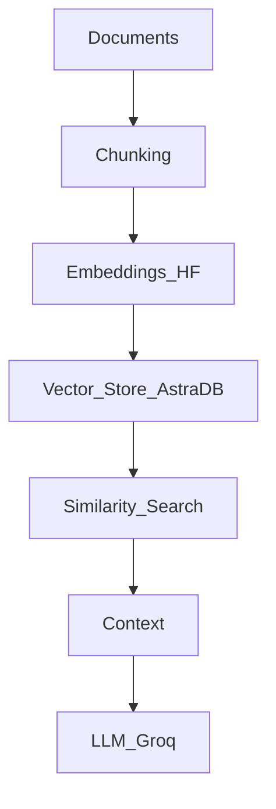

# 🛒 GenAI RAG Product Recommender

[](https://universal-pdf-rag-chatbot-mhsi4ygebe6hmq3ij6d665.streamlit.app/)
[](https://www.python.org/downloads/release/python-390/)
[](https://opensource.org/licenses/MIT)
[](https://www.docker.com/)
[](https://kubernetes.io/)

> **A production-grade E-commerce Recommendation System built with RAG Architecture, Groq Llama 3, LangChain, and AstraDB.** 
> *Deployed on Kubernetes with Prometheus/Grafana O11y.*

---

## ⚡ Overview

The **Flipkart Product Recommender** is an intelligent conversational AI that goes beyond keyword search. It leverages **Retrieval-Augmented Generation (RAG)** to understand user intent and semantically retrieve relevant product reviews from **AstraDB**, generating helpful responses using **Groq's Llama 3.1** engine.

This project demonstrates a complete **End-to-End LLMOps Pipeline**, including data ingestion, vector storage, RAG chain orchestration, backend API, frontend UI, and cloud-native deployment.

---

## 🚀 Project Links

- 🌐 **Live Demo:** [Streamlit App](https://universal-pdf-rag-chatbot-mhsi4ygebe6hmq3ij6d665.streamlit.app/)
- 📖 **Documentation:** [GitHub Wiki](https://github.com/Ratnesh-181998/Flipkart-Product-Recommender-RAG)
- 🐛 **Issue Tracker:** [GitHub Issues](https://github.com/Ratnesh-181998/Flipkart-Product-Recommender-RAG)
- 🐙 **Repository:** [GitHub](https://github.com/Ratnesh-181998/Flipkart-Product-Recommender-RAG)

---

## 🏗️ Technical Architecture & Ecosystem

### 🛠️ Tech Stack Breakdown
1.  **Groq**: LLM Inference Engine involved.
2.  **HuggingFace**: Embedding Model provider.
3.  **GCP VM**: Cloud Virtual Machine for hosting.
4.  **LangChain**: GenAI Framework for LLM interaction.
5.  **Minikube**: Local Kubernetes Cluster inside VM.
6.  **Docker**: Application Containerization.
7.  **Flask**: Backend API Framework.
8.  **HTML/CSS**: Frontend UI Technologies.
9.  **Kubectl**: Kubernetes CLI Tool.
10. **GitHub**: Source Code Management (SCM).
11. **AstraDB**: Serverless Online Vector Store.
12. **Prometheus**: Real-time Metrics Collection.
13. **Grafana**: Metrics Visualization Dashboard.

---

### 🔹 High-Level Architecture
**User → UI → Backend → LLM + Vector DB → Response → UI**

---

### 🧠 Core AI Layer

#### 1. Groq (LLM)
*   **Role**: Inference engine for ultra-low latency LLM responses.
*   **Function**: Handles final answer generation after context retrieval.
*   **Why**: Ideal for real-time GenAI apps.

#### 2. Hugging Face (Embedding Model)
*   **Role**: Converts text chunks into vector embeddings.
*   **Usage**:
    *   **Ingestion**: Documents → Vectors
    *   **Query Time**: User Query → Vector

#### 3. AstraDB (Vector Store)
*   **Role**: Online, managed vector database.
*   **Function**: Stores embeddings & performs semantic similarity search.
*   **Why**: Cloud-native, Scalable, No infra overhead, Free tier.

---

### 📚 RAG Pipeline


---

### 🔗 Orchestration Layer

#### 4. LangChain
*   **Role**: The "Glue" connecting LLM, Embeddings, and Vector DB.
*   **Handles**: Prompt templates, Retrieval logic, Context injection.
*   **Benefit**: Enables clean RAG workflows.

---

### ⚙️ Backend & Frontend

#### 5. Flask
*   **Role**: Backend REST API.
*   **Responsibilities**: Accept queries, Call RAG pipeline, Return response.

#### 6. HTML / CSS / Streamlit
*   **Role**: Simple Frontend UI.
*   **Responsibilities**: Send requests to Backend, Display LLM responses.

---

### 🐳 Deployment & Infrastructure

#### 7. Docker
*   **Role**: Containerizes the application.
*   **Benefits**: Consistency, Portability, CI/CD compatibility.

#### 8. Minikube
*   **Role**: Local Kubernetes cluster inside a VM.
*   **Usage**: Simulating production-grade K8s locally.

#### 9. Kubectl
*   **Role**: CLI tool for Kubernetes.
*   **Operations**: Deploy pods, Manage services, Inspect logs, Scale workloads.

#### 10. GCP VM
*   **Role**: Google Cloud Virtual Machine.
*   **Usage**: Hosts Minikube, Docker containers, and exposes app publicly.

---

### 📈 Monitoring & Observability (LLMOps)

#### 11. Prometheus
*   **Role**: Real-time metrics collection.
*   **Metrics**: CPU/Memory, Latency, API Throughput.
*   **Source**: Scrapes data from K8s services.

#### 12. Grafana
*   **Role**: Visualization Dashboard.
*   **Usage**: Displays Prometheus metrics, System Health, Performance monitoring.

---

### 🔁 DevOps & Collaboration

#### 13. GitHub
*   **Role**: Source Code Management (SCM).
*   **Usage**: Version control, Collaboration, CI/CD integration.

---

### 🧩 One-Line Summary
> "I built a production-style RAG-based GenAI system using **Groq LLM**, **Hugging Face** embeddings, **AstraDB** as a vector store, orchestrated via **LangChain**, containerized with **Docker**, deployed on **Kubernetes** (Minikube on GCP VM), and monitored using **Prometheus** and **Grafana**."

---

## 📱 UI Features (Application Tabs)

### 1️⃣ 🎬 **Live Demo**
The main interface where users interact with the Recommendation Engine.
- **Chat Interface:** ChatGPT-style conversational UI.
- **Product Cards:** AI dynamically generates product cards with Price, Rating, and "Buy Now" links.
- **Real-time RAG:** Fetches context from thousands of reviews in milliseconds.

### 2️⃣ 📖 **About Project**
A detailed breakdown of the problem statement and solution.
- **Problem:** Keyword search fails to understand context (e.g., "good camera phone for night shots").
- **Solution:** Semantic Vector Search bridges the gap between query and data.
- **Impact:** Increases conversion rates and user engagement.

### 3️⃣ 🔧 **Tech Stack**
Visual representation of the technologies used.
- **Frontend:** HTML/CSS, Streamlit
- **Backend:** Flask, LangChain
- **Database:** AstraDB (Vector)
- **AI:** Groq, HuggingFace
- **Monitoring:** Prometheus, Grafana

### 4️⃣ 🏗️ **Architecture**
Interactive diagrams explaining the system flow.
- **Data Flow:** Ingestion -> Embedding -> Storage -> Retrieval.
- **Workflow:** User -> UI -> API -> RAG Chain -> LLM.
- **Deep Dive:** Detailed explanation of the Kubernetes deployment.

### 5️⃣ 📋 **System Logs**
Real-time dashboard for developers.
- **Live Logs:** Tracks INFO, WARNING, and ERROR events.
- **Health Checks:** Monitors status of Flask, Database, and LLM connections.
- **Metrics:** Counts total API calls and errors.

---

## 📂 Directory Structure

```plaintext
Flipkart-Product-Recommender-RAG/
├── .streamlit/          # Streamlit configuration
├── data/                # Raw dataset (CSV/JSON)
├── flipkart/            # Core application logic package
├── grafana/             # Grafana dashboard configurations
├── prometheus/          # Prometheus monitoring rules
├── static/              # CSS styles and images
├── templates/           # HTML templates for Flask
├── utils/               # Helper functions (logger, exceptions)
├── .env.example         # Template for environment variables
├── .gitignore           # Git ignore rules
├── Dockerfile           # Docker build configuration
├── LICENSE              # MIT License
├── README.md            # Project documentation
├── app.py               # Flask backend entry point
├── flask-deployment.yaml# Kubernetes deployment for Flask
├── requirements.txt     # Python dependencies
├── setup.py             # Package installation script
└── streamlit_app.py     # Streamlit frontend entry point
```

---

## 🏗️ Architecture Diagrams & System Visuals


---

## 🔄 Detailed Workflow

1.  **Ingestion Layer**:
    *   Raw product reviews (CSV) are loaded using `langchain_community.document_loaders`.
    *   Text is chunked into manageable tokens using `RecursiveCharacterTextSplitter`.
2.  **Embedding Layer**:
    *   Chunks are passed through the `HuggingFaceEmbeddings` model (`BAAI/bge-base-en-v1.5`).
    *   Dense vector representations are generated.
3.  **Storage Layer**:
    *   Vectors are upserted into **AstraDB**, a serverless vector database built on Apache Cassandra.
4.  **Retrieval Layer**:
    *   User query is embedded on-the-fly.
    *   A semantic similarity search finds the top-k most relevant review chunks.
5.  **Generation Layer**:
    *   Retrieved chunks + User Query + Prompt Template are sent to **Groq**.
    *   **Llama 3.1** generates a human-like, context-aware response.

---

## 🔮 Future Roadmap

- [ ] **CI/CD Pipeline**: Automate testing and deployment using GitHub Actions.
- [ ] **User Auth**: Add login functionality to save user chat history.
- [ ] **Voice Support**: Enable voice-to-text for audio queries.
- [ ] **Multi-Modal**: Support image search for products.
- [ ] **A/B Testing**: Compare different LLM models (e.g., Mistral vs Llama 3).

---

## ❓ Troubleshooting

**Q: Why is the response taking too long?**
*A: Ensure you are using a valid Groq API key. Local internet connection speed can also affect AstraDB retrieval.*

**Q: 'Module not found' error?**
*A: Run `pip install -r requirements.txt` again in your virtual environment.*

**Q: Images not loading?**
*A: Check the `static/` folder to ensure all assets are present and paths are correct.*

---

## 🤝 Contributing

Contributions are welcome!
1.  Fork the repository.
2.  Create a feature branch (`git checkout -b feature/AmazingFeature`).
3.  Commit your changes (`git commit -m 'Add some AmazingFeature'`).
4.  Push to the branch (`git push origin feature/AmazingFeature`).
5.  Open a Pull Request.

---

## 🛠️ Local Installation

### Prerequisites
- Python 3.9+
- Docker (optional)
- Git

### Steps
1. **Clone the repository**
   ```bash
   git clone https://github.com/Ratnesh-181998/Flipkart-Product-Recommender-RAG.git
   cd Flipkart-Product-Recommender-RAG
   ```

2. **Create a Virtual Environment**
   ```bash
   python -m venv venv
   source venv/bin/activate  # On Windows: venv\Scripts\activate
   ```

3. **Install Dependencies**
   ```bash
   pip install -r requirements.txt
   ```

4. **Set Environment Variables**
   Create a `.env` file in the root directory:
   ```env
   GROQ_API_KEY=your_groq_key
   ASTRA_DB_TOKEN=your_astra_token
   ASTRA_DB_API_ENDPOINT=your_endpoint
   ```

5. **Run the Application**
   ```bash
   streamlit run streamlit_app.py
   ```

---

## 📄 License

Distributed under the **MIT License**. See `LICENSE` for more information.

---

## 📞 Contact

**RATNESH KUMAR SINGH**  
*Data Scientist (AI/ML) | 4+ Years Experience*

- 📧 **Email:** [rattudacsit2021gate@gmail.com](mailto:rattudacsit2021gate@gmail.com)
- 💼 **LinkedIn:** [linkedin.com/in/ratneshkumar1998](https://www.linkedin.com/in/ratneshkumar1998/)
- 🐙 **GitHub:** [github.com/Ratnesh-181998](https://github.com/Ratnesh-181998)
- 📱 **Phone:** +91-947XXXXX46

---
*Built with ❤️ using LangChain, Groq, and Streamlit.*
